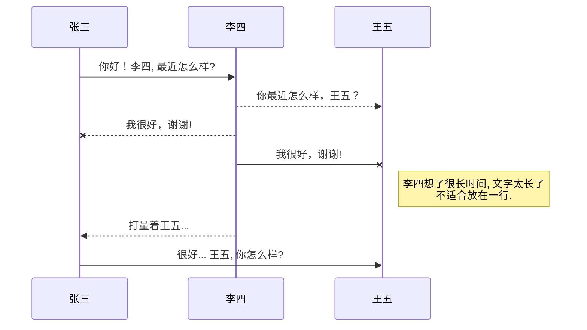
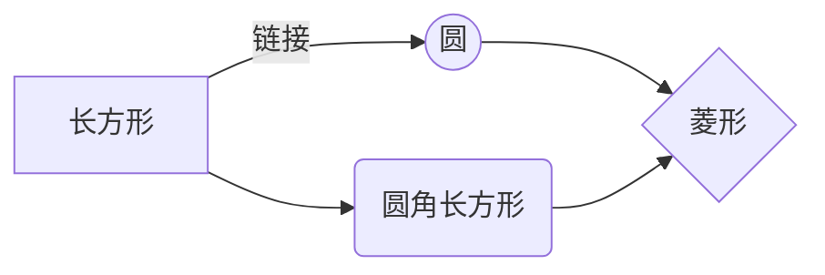

@[TOC](这里写自定义目录标题)

# 小书匠
设置栏-绑定-数据存储+图床服务都用`0fe7044e848eeb2d02cf91db026c14f3a466104f`作为token,该token在[token地址](https://github.com/settings/tokens)并设置所有权限

插入图片：直接拖拽并等待自动生成githab地址图床，
 
列表：
 1. 列表1
 2. 列表2

- 项目
  - 项目
    - 项目

1. 项目1
2. 项目2
3. 项目3

- [x] 计划任务
- [ ] 完成任务

Markdown
:  Text-to-HTML conversion tool

Authors
:  John
:  Luke

短命令：<kbd>Ctrl/Command</kbd> + <kbd>Z</kbd>
 
文本形式：**加粗**  *斜体文本*  ==标记文本 #CDDC39== ~~删除文本~~  H~2~O 下标 2^10^ 上标

> 引用文本1
> > 引用文本2

链接: [链接](https://github.com/OneJane)

图片: 

带尺寸的图片: ![Alt]https://avatars1.githubusercontent.com/u/15198872?s=460&v=4=30x30)

居中的图片: 

居中并且带尺寸的图片: 

去[博客设置](https://mp.csdn.net/configure)页面，选择一款你喜欢的代码片高亮样式，下面展示同样高亮的 `代码片`.
```javascript
// An highlighted block
var foo = 'bar';
```
 
表格：
| 项目 | Value |
| ---- | ----- |
| 电脑 | $1600 |
| 手机 | $12   |
| 导管 | $1    |
 
使用`:---------:`居中
使用`:----------`居左
使用`----------:`居右
|     第一列     |         第二列 | 第三列         |
| :------------: | -------------: | :------------- |
| 第一列文本居中 | 第二列文本居右 | 第三列文本居左 |
  

# UML 图表

可以使用UML图表进行渲染。 [Mermaid](https://mermaidjs.github.io/). 例如下面产生的一个序列图：:



这将产生一个流程图。:



# FLowchart流程图

我们依旧会支持flowchart的流程图：
```mermaid
flowchat
st=>start: 开始
e=>end: 结束
op=>operation: 我的操作
cond=>condition: 确认？

st->op->cond
cond(yes)->e
cond(no)->op
``` 
 